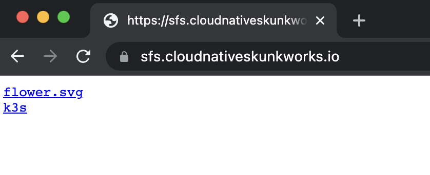

# sfs ( Stupid File Server )

[](https://codeclimate.com/github/AlexsJones/sfs/maintainability)

- I want to be able to serve binaries and other things inside a Kubernetes cluster.

- I don't want all the ceremony of having to stand up nginx and mess around with it's config.

- I also don't want it to have to rely on any existing data storage ( it should pull the files in).


For example:

```
config:
- filename: k3s
  url: https://github.com/k3s-io/k3s/releases/download/v1.22.3+k3s1/k3s
- filename: flower.svg
  url: https://d33wubrfki0l68.cloudfront.net/69e55f968a6f44613384615c6a78b881bfe28bd6/42cd3/_common-resources/images/flower.svg

```


This becomes accessible at via the service in cluster `http://sfs:8100/k3s`

Or using the Ingress example ... `https://sfs.cloudnativeskunkworks.io/flower.svg`




## Install

- Setup the files you want to download in the helm chart.

- `make helm`  or `cd chart && helm install --upgrade sfs .`


### configuration

_See chart/values.yaml_
